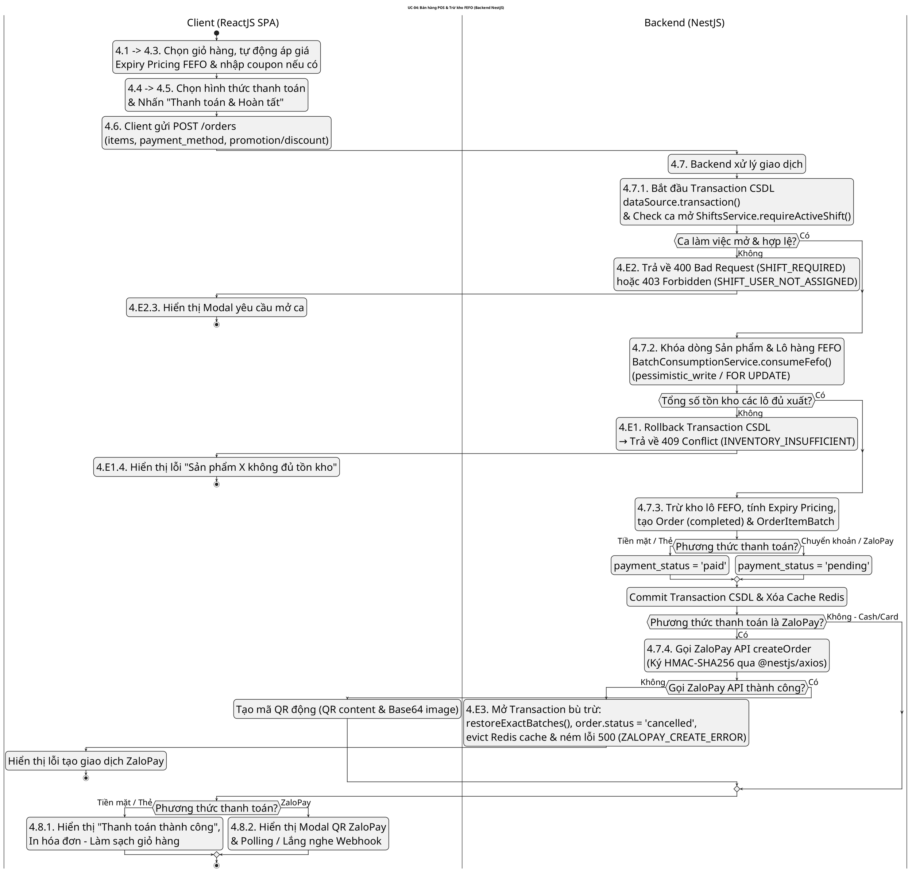
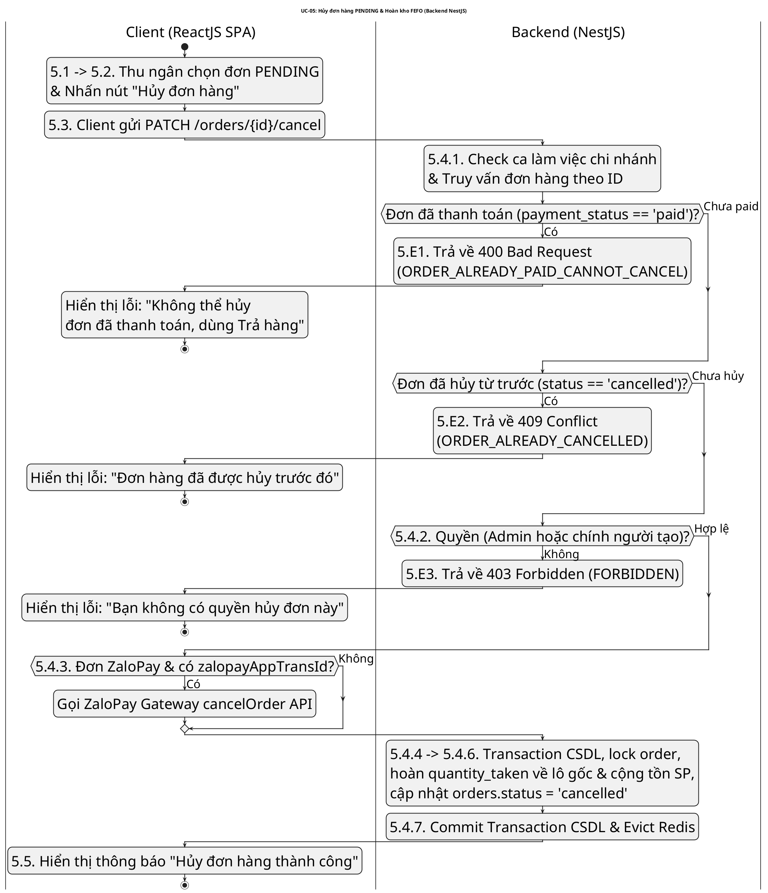
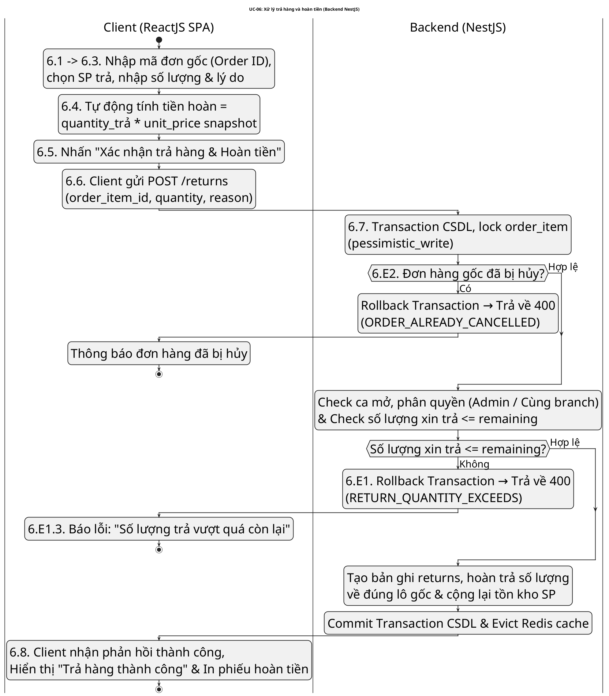
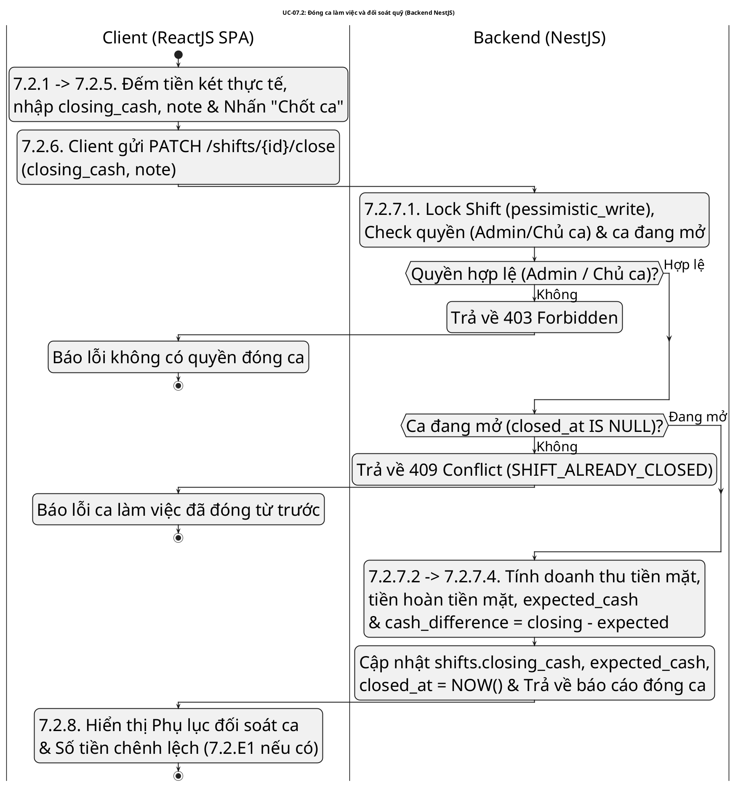
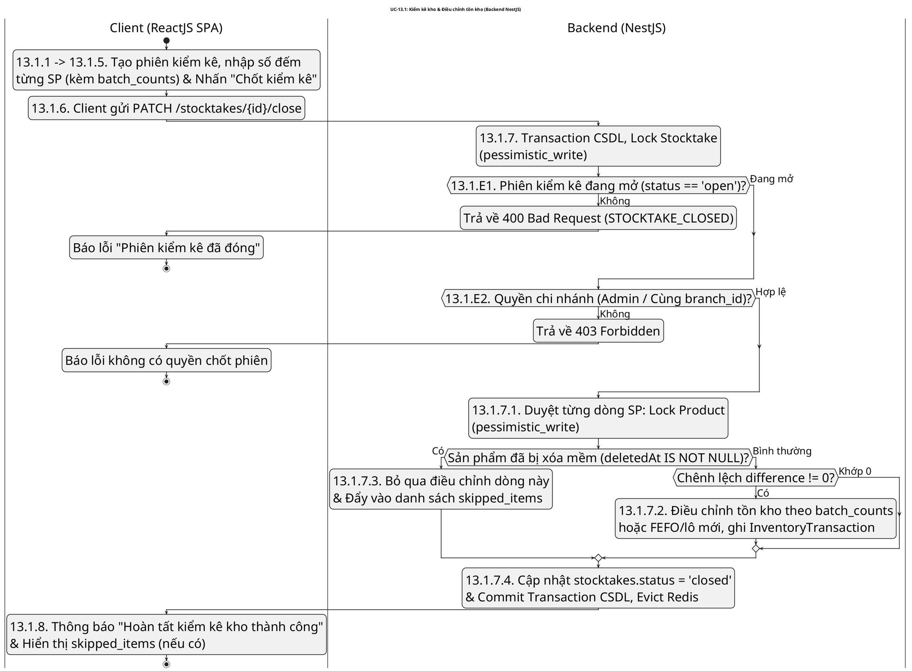

# ACTIVITY DIAGRAMS – BACKEND NESTJS (TRẮNG ĐEN MONOCHROME, FONT CHỮ 40PX TO RÕ, TỐI ƯU KHỔ A4 WORD)

> **Ghi chú định dạng**:
> 1. **Kích thước chữ 40px (`DefaultFontSize 40`, `ActivityFontSize 40`, `ArrowFontSize 32`)**: Chữ siêu to, nét đậm, hiển thị rõ ràng ngay cả khi in ấn trên Word.
> 2. **Sắp xếp gọn gàng các nhóm activity**: Nhóm hợp lý các thao tác chuẩn bị liên tiếp (4.1 -> 4.3, 4.4 -> 4.5) để chiều cao sơ đồ vừa vặn, không bị kéo quá dài làm mờ chữ.
> 3. **Phong cách Trắng - Đen (Monochrome)**: Thuần trắng đen 100% không màu sắc.
> 4. **Tối ưu khổ A4 Word (Lề trái 3.4cm, Lề phải 2.0cm)**: Ngắt dòng ngắn bằng `\n`.
> 5. **Rà soát 100% từng bước theo đặc tả Use Case cập nhật**: Đầy đủ các bước và các trường hợp ngoại lệ.

---

## UC-04: BÁN HÀNG POS (FEFO & THANH TOÁN ZALOPAY)

---

## UC-05: HỦY ĐƠN HÀNG (PENDING)

---

## UC-06: XỬ LÝ TRẢ HÀNG VÀ HOÀN TIỀN

---

## UC-07.2: ĐÓNG CA LÀM VIỆC VÀ ĐỐI SOÁT QUỸ

---

## UC-13.1: KIỂM KÊ KHO VÀ TỰ ĐỘNG ĐIỀU CHỈNH TỒN KHO

