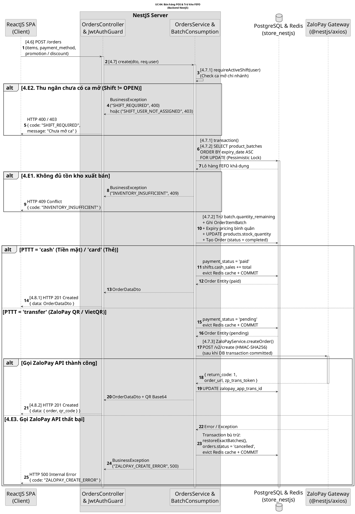
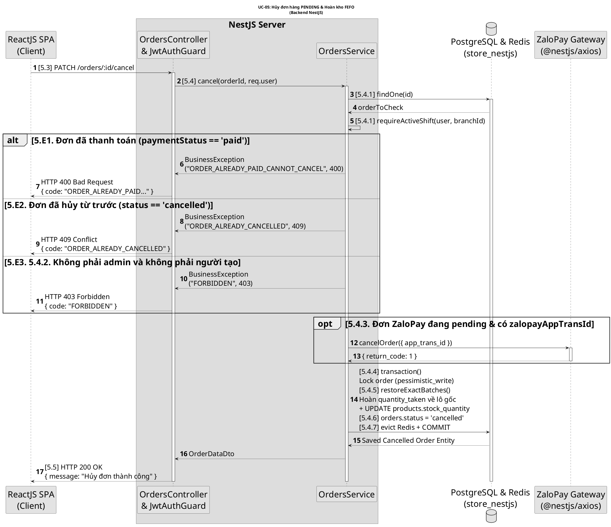
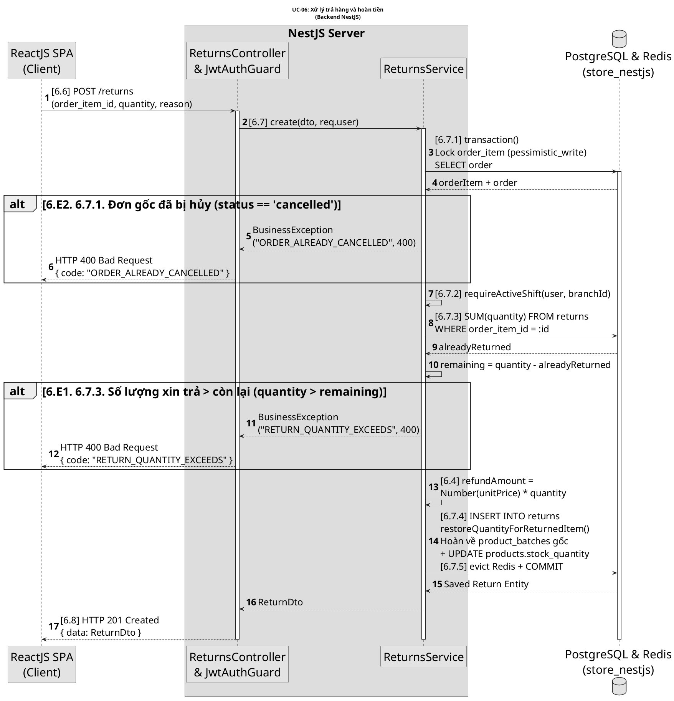
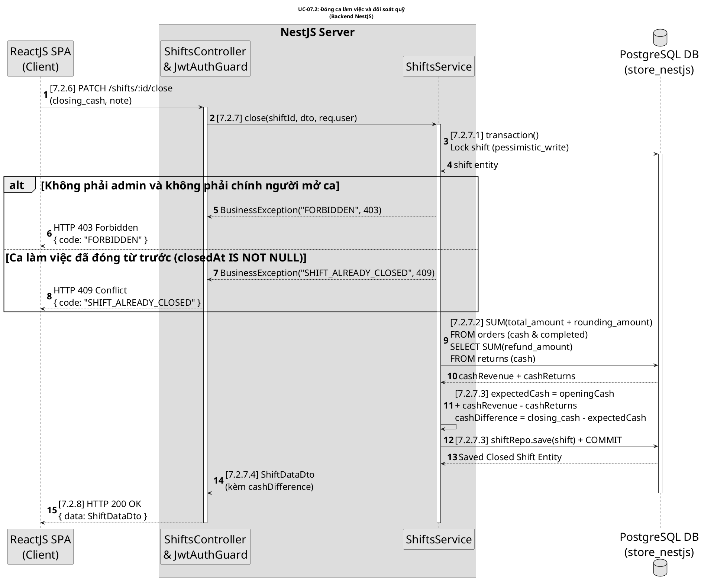
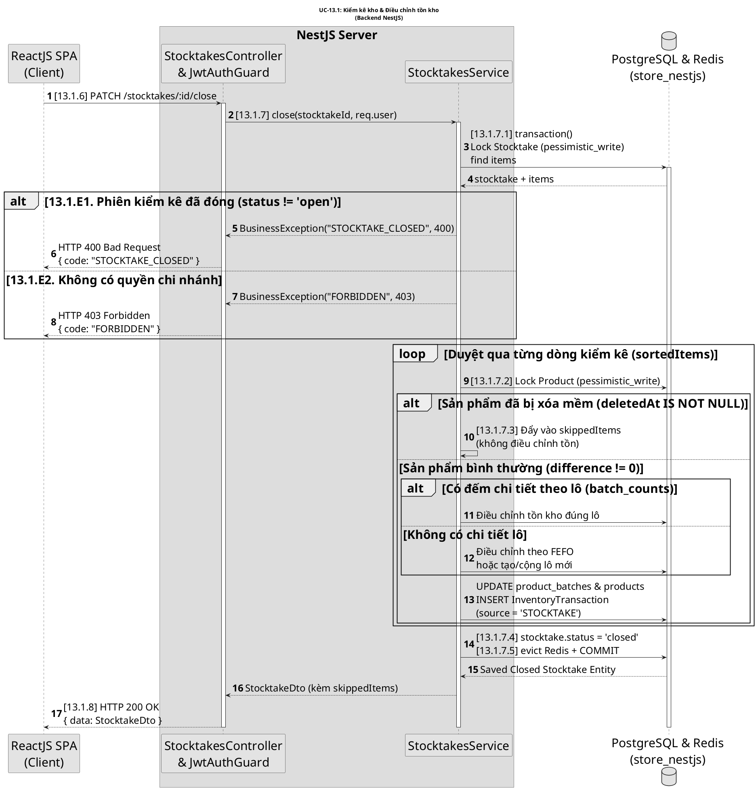

# SEQUENCE DIAGRAMS – BACKEND NESTJS (TRẮNG ĐEN MONOCHROME, ĐUỔI CHUẨN ĐẶC TẢ A4 WORD)

> **Ghi chú định dạng**:
> 1. **Phong cách Trắng - Đen (Monochrome)**: Loại bỏ toàn bộ màu sắc nền, màu nốt, màu hộp (`box`) để đảm bảo sơ đồ thuần trắng đen chuẩn mực cho tài liệu in ấn / luận văn.
> 2. **Tối ưu khổ A4 trong Word (Lề trái 3.4cm, Lề phải 2.0cm)**: Sử dụng `skinparam DefaultFontSize 30`, `skinparam ParticipantFontSize 30`, ngắt dòng ngắn bằng `\n` (tối đa 20-25 ký tự/dòng) giúp chữ không bị nén hay thu nhỏ.
> 3. **Đã đối chiếu 100% từng mã bước chính xác theo Đặc tả**: [4.6], [4.7.1], [4.7.2], [4.7.3], [4.8.1], [4.8.2],... không bỏ sót mã bước nào.

---

## 1. UC-04: BÁN HÀNG POS & TRỪ KHO FEFO

---

## 2. UC-05: HỦY ĐƠN HÀNG (PENDING)

---

## 3. UC-06: XỬ LÝ TRẢ HÀNG VÀ HOÀN TIỀN

---

## 4. UC-07.2: ĐÓNG CA LÀM VIỆC VÀ ĐỐI SOÁT QUỸ

---

## 5. UC-13.1: KIỂM KÊ KHO VÀ TỰ ĐỘNG ĐIỀU CHỈNH TỒN KHO

